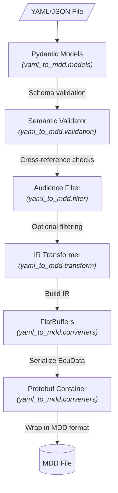

# yaml-to-mdd Documentation Index

This document provides an index of all available documentation for the yaml-to-mdd project.

## User Documentation

### Getting Started
- [README.md](../README.md) - Installation, quick start, CLI reference
- [examples/README.md](../examples/README.md) - Example files overview

### Examples
- [examples/minimal/](../examples/minimal/) - Bare minimum required configuration
  - [minimal-ecu.yaml](../examples/minimal/minimal-ecu.yaml) - Minimal YAML file
  - [README.md](../examples/minimal/README.md) - Minimal example documentation
- [examples/basic/](../examples/basic/) - Common features for typical ECUs
  - [basic-ecu.yaml](../examples/basic/basic-ecu.yaml) - Basic YAML file
  - [README.md](../examples/basic/README.md) - Basic example documentation

### YAML Schema Reference
The schema documentation is in the `yaml-schema/` directory (sibling of yaml-to-mdd):
- [SCHEMA.md](../../yaml-schema/SCHEMA.md) - Complete schema reference
- [ODX_YAML_MAPPING.md](../../yaml-schema/ODX_YAML_MAPPING.md) - ODX to YAML mapping
- [schema.json](../../yaml-schema/schema.json) - JSON Schema for validation

### Full Examples
- [example-ecm.yml](../../yaml-schema/example-ecm.yml) - Full-featured example with all schema capabilities

## Developer Documentation

### Architecture
- [design.md](design.md) - System architecture and design decisions

### API Reference
- [api-examples.md](api-examples.md) - Programmatic usage examples

### Module Documentation
The main modules are documented in their `__init__.py` files:

- `yaml_to_mdd.models` - Pydantic models for YAML schema validation
- `yaml_to_mdd.transform` - YAML to IR transformation
- `yaml_to_mdd.converters` - IR to MDD (FlatBuffers/Protobuf) conversion
  - Includes `MDDWriter` for writing and `MDDReader` for reading MDD files
- `yaml_to_mdd.validation` - Semantic validation beyond schema
- `yaml_to_mdd.filter` - Audience filtering
- `yaml_to_mdd.ir` - Intermediate Representation data structures
- `yaml_to_mdd.cli` - Command-line interface utilities

## Quick Reference

### CLI Commands

```bash
# Validate
yaml-to-mdd validate <file> [-q] [-s] [-f text|table|tree] [--verbose]

# Convert
yaml-to-mdd convert <file> [-o output.mdd] [-a audience] [-c lzma|gzip|zstd|none] [-f] [--dry-run] [-V]

# Info
yaml-to-mdd info <file>

# Version
yaml-to-mdd --version
```

### Python API

```python
from yaml_to_mdd.models import load_diagnostic_description
from yaml_to_mdd.transform import YamlToIRTransformer
from yaml_to_mdd.converters import MDDWriter

# Load and validate
doc = load_diagnostic_description("ecu.yaml")

# Transform to IR
ir_db = YamlToIRTransformer().transform(doc)

# Write MDD (default compression: lzma)
MDDWriter().write(ir_db, "ecu.mdd")
```

### Conversion Pipeline



## Related Projects

- [odx-converter](https://github.com/eclipse-opensovd/odx-converter) - ODX to MDD converter (Kotlin)
- [classic-diagnostic-adapter](https://github.com/eclipse-opensovd/classic-diagnostic-adapter) - MDD runtime consumer
- [odxtools](https://github.com/mercedes-benz/odxtools) - ODX Python library
