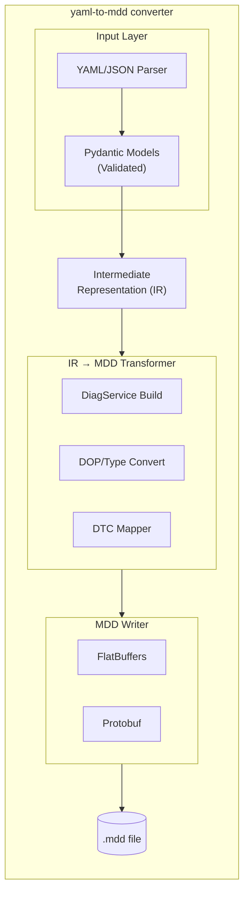
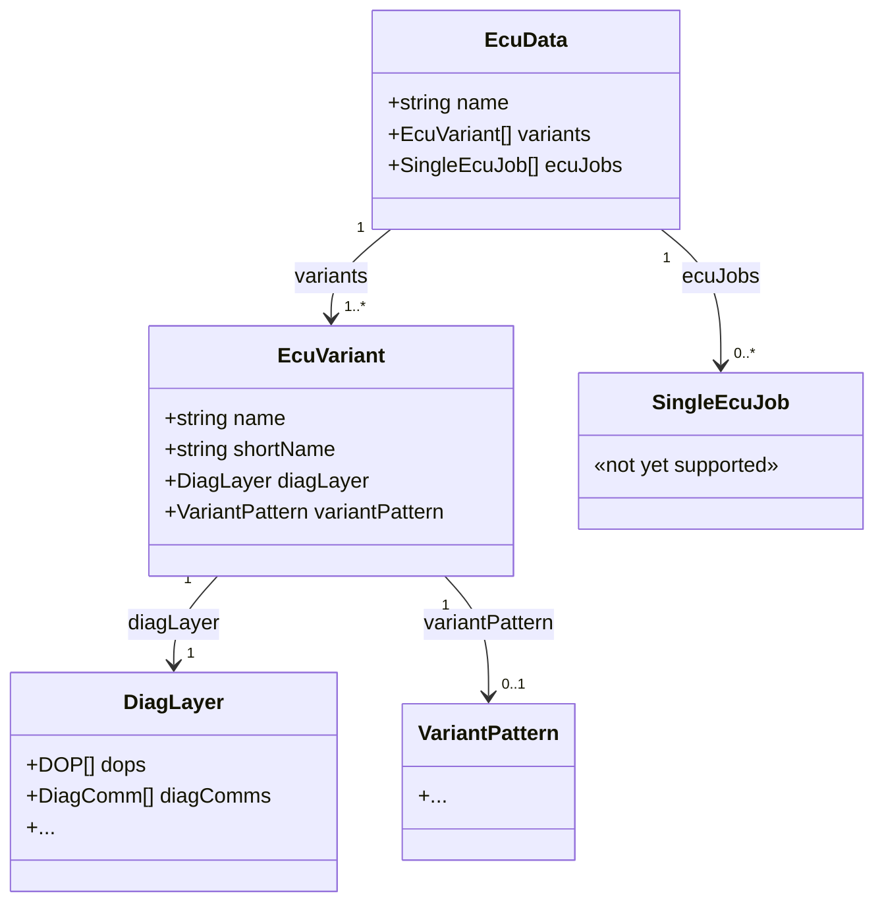

# yaml-to-mdd Design Document

## 1. Introduction

### 1.1 Purpose

This document describes the architecture and design of the `yaml-to-mdd` converter, a tool that transforms OpenSOVD CDA Diagnostic Description files (YAML/JSON) into the MDD binary format.

### 1.2 Goals

1. **Primary**: Enable conversion from human-readable YAML to MDD binary format
2. **Secondary**: Discover gaps in the YAML schema through implementation
3. **Tertiary**: Provide a foundation for future tooling (validation, round-trip, etc.)

### 1.3 Non-Goals (Current Scope)

- ECU Jobs with embedded code
- ODX export/integration
- MDD → YAML reverse conversion

## 2. System Overview

### 2.1 High-Level Architecture



### 2.2 Data Flow

1. **Input**: YAML/JSON file conforming to `opensovd.cda.diagdesc/v1` schema
2. **Parsing**: PyYAML loads the file, Pydantic validates and deserializes
3. **Transformation**: Domain models are converted to an Intermediate Representation
4. **Serialization**: IR is serialized to FlatBuffers, wrapped in Protobuf container
5. **Output**: Binary MDD file

## 3. Component Design

### 3.1 Input Layer

#### 3.1.1 YAML Parser

- Uses `PyYAML` for parsing
- Supports both `.yaml` and `.json` input
- Handles hex string notation (`0xF190`) transparently

#### 3.1.2 Pydantic Models

Models mirror the JSON Schema structure with Python-native types:

```python
class DiagnosticDescription(BaseModel):
    schema_: Literal["opensovd.cda.diagdesc/v1"] = Field(alias="schema")
    meta: Meta
    ecu: Ecu
    sessions: dict[str, Session]
    services: Services
    access_patterns: dict[str, AccessPattern]
    # Optional sections
    security: dict[str, SecurityLevel] | None = None
    types: dict[str, TypeDefinition] | None = None
    dids: dict[HexKey, DidDefinition] | None = None
    dtcs: dict[str, DtcDefinition] | None = None
    # ...
```

Key design decisions:
- **Hex handling**: Custom type `HexInt` that accepts both `0xF190` and `61840`
- **Validation**: Pydantic validators ensure semantic correctness
- **Aliases**: JSON Schema keys like `schema` are aliased to avoid Python keywords

### 3.2 Intermediate Representation (IR)

The IR bridges YAML domain concepts to MDD structures:

```python
@dataclass(frozen=True)
class IRDiagService:
    """Represents a diagnostic service in MDD terms"""
    short_name: str
    long_name: str | None
    semantic: str | None  # "ID", "ROUTINE", "DTC", etc.
    addressing: str | None  # "physical", "functional", "both"
    request: IRRequest
    positive_responses: tuple[IRResponse, ...]
    negative_responses: tuple[IRResponse, ...]
    service_type: IRServiceType

@dataclass(frozen=True)
class IRDOP:
    """Data Object Property - represents a typed data element"""
    short_name: str
    long_name: str | None
    data_type: IRDataType
    diag_coded_type: IRDiagCodedType
    compu_method: IRCompuMethod | None
    unit: str | None
    bit_length: int

@dataclass
class IRDatabase:
    """Root IR structure, maps to MDD DiagLayer"""
    ecu_name: str
    revision: str
    author: str | None = None
    description: str | None = None
    schema_version: str = "opensovd.cda.diagdesc/v1"
    dops: dict[str, IRDOP] = field(default_factory=dict)
    services: dict[str, IRDiagService] = field(default_factory=dict)
    sessions: dict[str, int] = field(default_factory=dict)
    security_levels: dict[str, int] = field(default_factory=dict)
    did_read_services: dict[int, str] = field(default_factory=dict)
    did_write_services: dict[int, str] = field(default_factory=dict)
    routine_services: dict[int, list[str]] = field(default_factory=dict)
    memory_regions: list[IRMemoryRegion] = field(default_factory=list)
    data_blocks: list[IRDataBlock] = field(default_factory=list)
    dtcs: list[IRDTC] = field(default_factory=list)
    variants: list[IRVariant] = field(default_factory=list)
```

### 3.3 Converters

#### 3.3.1 Type Converter

Transforms YAML type definitions to DOPs and CompuMethods:

| YAML Type          | DOP Type           | CompuMethod             |
| ------------------ | ------------------ | ----------------------- |
| `base: u8/u16/u32` | `REGULAR`          | `IDENTICAL` or `LINEAR` |
| `enum: {...}`      | `REGULAR`          | `TEXT_TABLE`            |
| `base: struct`     | `STRUCTURE`        | N/A                     |
| `base: bytes`      | `END_OF_PDU_FIELD` | N/A                     |

```python
def convert_type(type_def: TypeDefinition) -> IR_DOP:
    if type_def.enum:
        return create_text_table_dop(type_def)
    elif type_def.scale or type_def.offset:
        return create_linear_dop(type_def)
    else:
        return create_identical_dop(type_def)
```

#### 3.3.2 DID Converter

Transforms DID definitions into DiagServices:

```python
def convert_did(did_id: int, did_def: DidDefinition) -> list[IR_DiagService]:
    services = []

    if did_def.readable:
        services.append(create_read_did_service(did_id, did_def))  # SID 0x22

    if did_def.writable:
        services.append(create_write_did_service(did_id, did_def))  # SID 0x2E

    return services
```

Request/Response structure for ReadDataByIdentifier:
```
Request:  [SID=0x22] [DID_HI] [DID_LO]
Response: [SID=0x62] [DID_HI] [DID_LO] [DATA...]
```

#### 3.3.3 DTC Converter

Transforms DTC definitions:

```python
def convert_dtc(dtc_id: str, dtc_def: DtcDefinition) -> IR_DTC:
    return IR_DTC(
        trouble_code=dtc_def.code,  # e.g., 0x010300
        display_trouble_code=dtc_id,  # e.g., "P0103"
        text=dtc_def.description,
        level=dtc_def.severity,
        sdgs=convert_sdgs(dtc_def.annotations)
    )
```

### 3.4 Output Layer

#### 3.4.1 FlatBuffers Converter

Constructs the `EcuData` FlatBuffer following the schema from odx-converter.

**FlatBuffers Structure:**



**Implementation:**
```python
class IRToFlatBuffersConverter:
    def __init__(self, builder_size: int = 1024 * 1024):
        self._builder_size = builder_size
        self._dop_cache: dict[str, DOPT] = {}  # DOP deduplication

    def convert(self, db: IRDatabase) -> bytes:
        # Reset state for fresh conversion
        self._dop_cache.clear()

        # Create DiagLayer with DOPs and services
        diag_layer = DiagLayerT()
        diag_layer.dops = [self._convert_dop(dop) for dop in db.dops.values()]
        diag_layer.diagComms = [self._convert_service(svc) for svc in db.services.values()]

        # Create EcuVariant
        variant = EcuVariantT()
        variant.name = db.ecu_name
        variant.shortName = db.ecu_name
        variant.diagLayer = diag_layer

        # Create EcuData (root)
        ecu_data = EcuDataT()
        ecu_data.name = db.ecu_name
        ecu_data.variants = [variant]

        # Serialize
        builder = flatbuffers.Builder(self._builder_size)
        offset = ecu_data.Pack(builder)
        builder.Finish(offset)
        return bytes(builder.Output())
```

**Reading EcuData:**
```python
from yaml_to_mdd.fbs_generated.EcuData import EcuData

# Get FlatBuffers bytes from MDD chunk
flatbuf_bytes = chunk.data

# Parse EcuData (root type)
ecu_data = EcuData.GetRootAs(flatbuf_bytes, 0)

# Access variant and DiagLayer
variant = ecu_data.Variants(0)
diag_layer = variant.DiagLayer()

# Access services
for i in range(diag_layer.DiagCommsLength()):
    service = diag_layer.DiagComms(i)
    print(service.ShortName())
```

#### 3.4.2 MDD Writer

Wraps FlatBuffer data in Protobuf container:

```python
# MDD file structure:
# [FILE_MAGIC: 20 bytes] + [Protobuf MDDFile]
#
# FILE_MAGIC = "MDD version 0      \0" (20 bytes)

def write_mdd(ecu_data: bytes, metadata: dict, output_path: Path):
    # Create chunk
    chunk = Chunk()
    chunk.type = DataType.DIAGNOSTIC_DESCRIPTION
    chunk.data = ecu_data

    # Create file
    mdd_file = MDDFile()
    mdd_file.version = "2025-05-21"
    mdd_file.ecu_name = metadata["ecu_name"]
    mdd_file.chunks.append(chunk)

    # Write with magic header
    with open(output_path, "wb") as f:
        f.write(FILE_MAGIC)  # "MDD version 0      \0"
        f.write(mdd_file.SerializeToString())
```

**Reading MDD Files:**
```python
from yaml_to_mdd.proto_generated import MDDFile
from yaml_to_mdd.converters.mdd_writer import FILE_MAGIC

with open("ecu.mdd", "rb") as f:
    data = f.read()

# Strip the 20-byte magic header before parsing Protobuf
mdd = MDDFile()
mdd.ParseFromString(data[len(FILE_MAGIC):])
```

## 4. Key Mappings

### 4.1 YAML → MDD Structure Mapping

| YAML Section      | MDD Structure                                                |
| ----------------- | ------------------------------------------------------------ |
| `ecu`             | `EcuData.name`, `EcuVariant.name`, addressing in `DiagLayer` |
| `sessions`        | Embedded in service access control                           |
| `security`        | Referenced by services, not standalone                       |
| `dids`            | `DiagComm[]` with SID 0x22/0x2E in `DiagLayer`               |
| `routines`        | `DiagComm[]` with SID 0x31 in `DiagLayer`                    |
| `dtcs`            | `DTC[]` in `DiagLayer`                                       |
| `types`           | `DOP[]` referenced by params in `DiagLayer`                  |
| `access_patterns` | Mapped to service-level access                               |

### 4.2 Type System Mapping

```
YAML                          MDD
────                          ───
base: u8                  →   DiagCodedType(base=A_UINT32, bit_length=8)
base: u16, endian: big    →   DiagCodedType(base=A_UINT32, bit_length=16, is_highlow=true)
base: ascii, length: 17   →   DiagCodedType(base=A_ASCIISTRING, max_length=17)
scale: 0.25, offset: 0    →   CompuMethod(category=LINEAR, coeffs=[0, 0.25])
enum: {0x01: "ON"}        →   CompuMethod(category=TEXT_TABLE, scales=[...])
```

## 5. Error Handling

### 5.1 Validation Errors

Pydantic provides first-line validation:
```python
try:
    desc = DiagnosticDescription.model_validate(yaml_data)
except ValidationError as e:
    for error in e.errors():
        print(f"{error['loc']}: {error['msg']}")
```

### 5.2 Semantic Validation Errors

The validator uses structured error types for detailed reporting:
```python
class ValidationSeverity(Enum):
    ERROR = "error"
    WARNING = "warning"
    INFO = "info"

@dataclass(frozen=True)
class ValidationIssue:
    code: str        # e.g., "E001", "W001"
    message: str     # Human-readable message
    severity: ValidationSeverity
    location: ValidationLocation
    context: dict[str, Any] | None = None

@dataclass
class ValidationResult:
    is_valid: bool
    errors: list[ValidationIssue]
    warnings: list[ValidationIssue]
```

### 5.3 Loader Errors

File loading errors are reported through a dedicated exception:
```python
class LoaderError(Exception):
    """Error loading or parsing YAML/JSON file."""
    pass
```

## 6. Testing Strategy

### 6.1 Unit Tests

- Pydantic model validation
- Individual converter functions
- FlatBuffer/Protobuf serialization

### 6.2 Integration Tests

- End-to-end conversion of example files
- Comparison with reference MDD files from odx-converter

### 6.3 Fixtures

- `minimal-ecu.yml`: Minimal valid file for smoke tests
- `example-ecm.yml`: Full-featured example for comprehensive testing
- `reference.mdd`: Known-good MDD for binary comparison

## 7. Dependencies

| Package       | Version | Purpose                   |
| ------------- | ------- | ------------------------- |
| `pydantic`    | ^2.0    | Model validation          |
| `pyyaml`      | ^6.0    | YAML parsing              |
| `flatbuffers` | ^24.3   | FlatBuffers serialization |
| `protobuf`    | ^5.0    | Protobuf container        |
| `typer`       | ^0.15   | CLI framework             |
| `rich`        | ^13.0   | Terminal output           |

## 8. Future Considerations

### 8.1 Complex Types Support

When adding complex types support:
- Parse struct and array type definitions
- Map to FlatBuffers STRUCTURE and ARRAY DOP types
- Handle nested type references

### 8.2 ECU Jobs

When adding ECU Jobs:
- Parse `ecu_jobs` section
- Create `SingleEcuJob` FlatBuffer entries
- Handle code file chunks (separate from DIAGNOSTIC_DESCRIPTION)

### 8.3 ODX Integration

Potential integration with odxtools:
- Export YAML to ODX via odxtools data structures
- Import ODX to YAML (reverse of this tool)
- Validation against ODX semantics

## 9. References

- [OpenSOVD CDA Schema](../yaml-schema/schema.json)
- [MDD Format (FlatBuffers)](https://github.com/eclipse-opensovd/odx-converter/blob/main/database/src/main/fbs/diagnostic_description.fbs)
- [MDD Container (Protobuf)](https://github.com/eclipse-opensovd/odx-converter/blob/main/database/src/main/proto/file_format.proto)
- [odx-converter Implementation](https://github.com/eclipse-opensovd/odx-converter)
